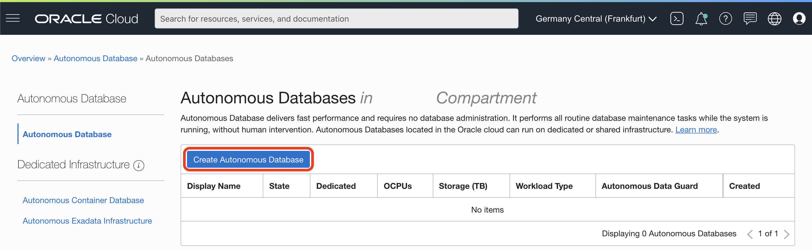
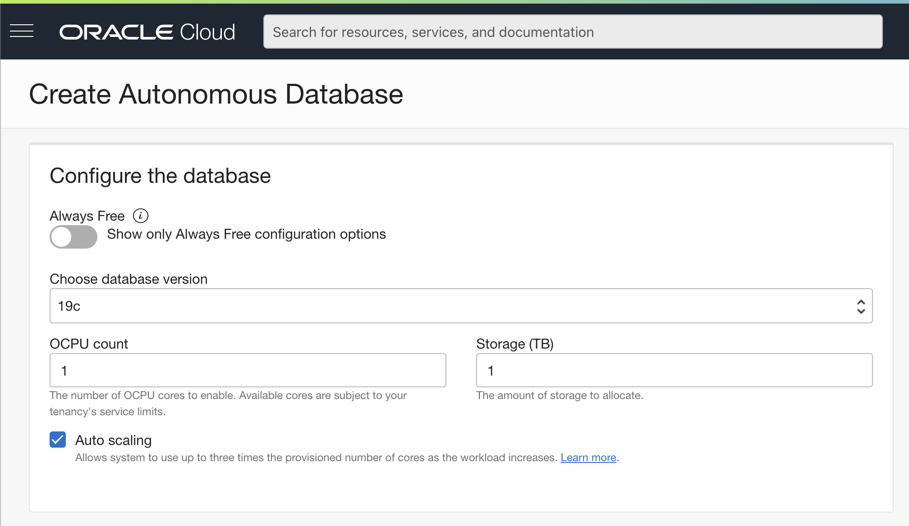

# Provision  Autonomous Data Warehouse

## Introduction

This lab walks you through the steps to get started using the Oracle Autonomous Database (Autonomous Data Warehouse [ADW] and Autonomous Transaction Processing [ATP]) on Oracle Cloud. In this lab, you provision a new ADW instance.

*Note: While this lab uses ADW, the steps are identical for creating an ATP database.*

Estimated Lab Time: 5 minutes

### Objectives

In this lab, you will:

-   Learn how to provision a new Autonomous Database

### Prerequisites

To complete this lab, you need to have the following:

- Logged into your Oracle Cloud Account

## **STEP 1**: Provision ADW

1. Go to **Menu** > **Oracle Database** > **Autonomous Data Warehouse**.

   

2. Click **Create Autonomous Database**.

   

3. Fill the first part of the provisioning form with the following values.

   

      - Compartment: `root` (You can select the root compartment, if not already selected)
      - Display name: `sailgp`
      - Database name: `sailgp`
      - Choose a workload type: `Data Warehouse`
      - Choose a deployment type: `Shared Infrastructure`

4. Fill the next part of the provisioning form with the following values.

   

      - Always Free: Turn it `on`, but it will work if you leave it `off` like in the screeshot.
      - Choose database version: `19c`, if your region has 21c it will equally work.
      - OCPU count: `1` or default value.
      - Storage (TB): `1` or default value.
      - Auto Scaling: `on` or default value.

5. Fill the last part of the provisioning form with the following values.

   

      - Password: `OracleCloud12345!`
      - Confirm password: `OracleCloud12345!`
      - Access Type: `Secure access from everywhere`
      - Choose a license type: `License Included`

6. Click **Create Autonomous Database**.

   We will see the new ADW Database provisioning.

   Wait for the icon to change from:

   

   To `ACTIVE` state:

   

7. Your Autonomous Data Warehouse is ready to use.

## **STEP 2**: Download Wallet

1. We will download the wallet file. The wallet file (client credentials), along with the database user ID and password, provides access to your Autonomous Database in the most secure way possible.

   > NOTE: Store wallet files in a secure location. Share wallet files only with authorized users.

2. On the ADW detail page, click **Download**.

   

3. Click **Download Wallet** on Database Connection side-screen.

   

4. Type the password, confirm the password by typing it again and click **Download**.

      - Password: `OracleCloud12345!`
      - Confirm Password: `OracleCloud12345!`

   

5. Click **Close**. A `ZIP` file will start downloading.

   

## **STEP 3**: Import Data

1. XXX

Please *proceed to the next lab*.

## **Acknowledgements**

- **Author** - Jeroen Kloosterman, Technology Product Strategy Director
- **Author** - Victor Martin, Technology Product Strategy Manager
- **Contributors** - XXX
