# Analytics

## Introduction

In this lab you'll get a taste of what it is to be a Data Athlete for SailGP! One of their jobs is to do a post-race analysis. The goal of such an analysis is to find out why one boat finishes before the other one. You'll do this by looking for clues in the data and calculate various performance metrics. The final goal of this is to help the sailing teams to perform better in the upcoming race!

The tool that will make this possible is **Oracle Analytics Cloud**, which will work on data that's stored and processed by **Oracle Autonomous Data Warehouse**.

Estimated Lab Time: 30 minutes

### Objectives
- Learn how a SailGP Data Athlete extracts valuable insights from sensor data
- Learn how to use Oracle Analytics Cloud to prepare and analyze data

### Prerequisites
- An Oracle Free Tier, Always Free, Paid or LiveLabs Cloud Account (see prerequisites in workshop menu)
- Oracle Analytics Cloud
- Autonomous Data Warehouse

## **STEP 1**: Create the connection from Oracle Analytics Cloud to Autonomous Database

**Oracle Analytics Cloud** will be the tool which you use to analyze your data. **Autonomous Data Warehouse** is used to store and organize the data.
Therefore we need to create a connection from Oracle Analytics Cloud to Autonomous Data Warehouse first. To be able to create this connection, OAC will need to use a so-called "wallet" file. The wallet file (client credentials), along with the database user ID and password, provides access to your Autonomous Database in the most secure way possible. The "wallet" file can be obtained from the database menus.

1. In Oracle Cloud, click the **Navigation Menu** in the upper left, navigate to **Oracle Database**, and select **Autonomous Data Warehouse**.

	

    You can see all the **ADW** instances that you have **created**.
    **Select** the instance that we created before.

    

2. We will download the wallet file. The wallet file (client credentials), along with the database user ID and password, provides access to your Autonomous Database in the most secure way possible.

   > NOTE: Store wallet files in a secure location. Share wallet files only with authorized users.

3. On the ADW detail page, click **Download**.

   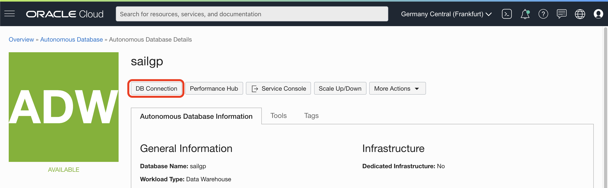

4. Click **Download Wallet** on Database Connection side-screen.

   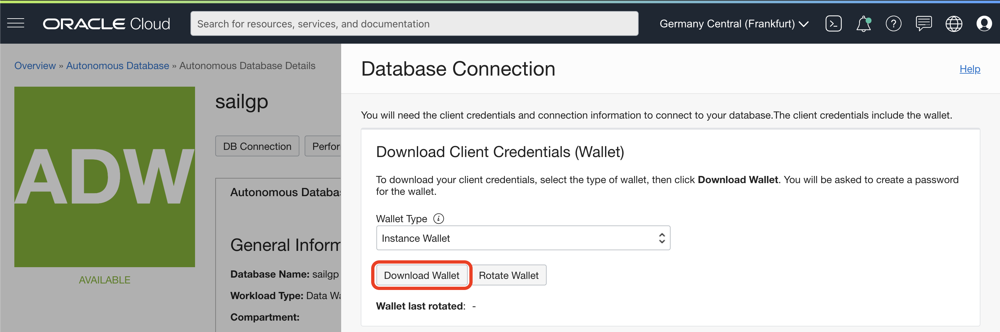

5. Type the password, confirm the password by typing it again and click **Download**.

      - Password: `sailgp12345!`
      - Confirm Password: `sailgp12345!`

   

6. Click **Close**. A `ZIP` file will start downloading.

   

7. Use the Wallet in Oracle Analytics Cloud

    **Return** to the **Oracle Cloud Infrastructure console** and click on the menu icon on the left.
    **Navigate** to **Analytics** and then **Analytics Cloud**.

    

7. **Open** the Cloud Analytics **URL** associated with your instance (the one that we created in Lab 2) by using the dots menu button on the right-hand side of your instance information and selecting **Analytics Home Page**.

    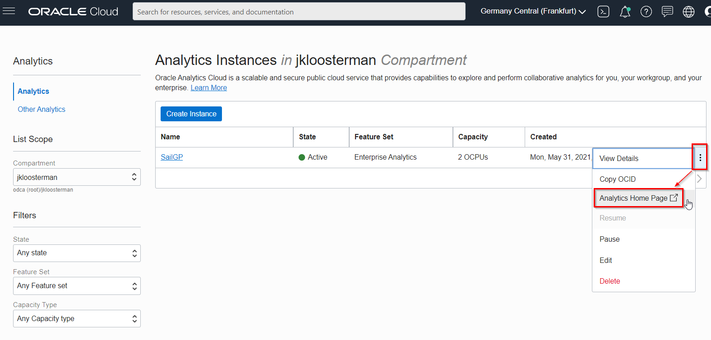

    The **Oracle Analytic**s page will open in a new browser **window/tab**.

8. On the top right-hand side of the screen, click **Create**, and then **Connection**.

    

9. Choose **Oracle Autonomous Data Warehouse**.

    

    Use the following information to configure your **connection**.

    > **Connection Name**: SAILGP
    >
    > **Client Credentials**: Use the Browse button to upload the **wallet zip > file** that you downloaded. It will automatically extract the cwallet.sso file from this zip bundle.
    >
    > **Username**: ADMIN
    >
    > **Password**: The password that you created on the ADW instance creation at the beginning of the workshop. OracleCloud12345!
    >
    > **Service Name**: Keep the default, the name of your database followed by the \_high suffix.
    >

    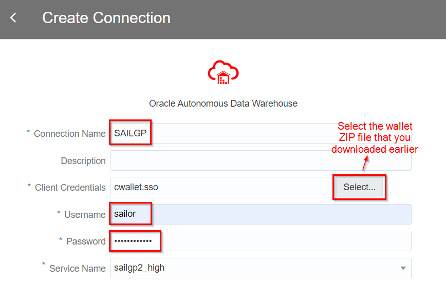

10. Select **Save** to save your new connection **information**.

## **STEP 2:** Add the dataset to Oracle Analytics Cloud

We're going to take a deep dive on the SailGP regatta that took place in Bermuda in April 2021. In particular we're going to have a look at race 4 (out of 7 in total). We're going to do a post race analysis with the goal of helping the teams perform better in the upcoming race.

Earlier, we uploaded the data of this race to Autonomous Datawarehouse. Now, we have to make this available to Oracle Analytics Cloud.

1. On the top right, choose Create and then Dataset.

   

2. Select the SAILGP connection.

   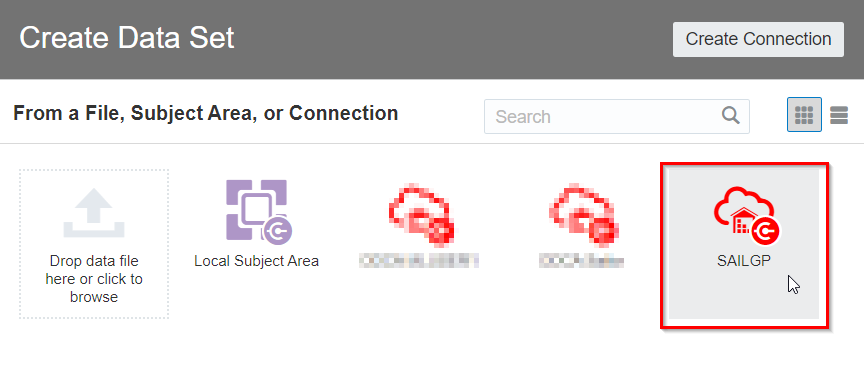

3. Open the ADMIN schema and double click on the SGP_STRM_PIVOT table.

   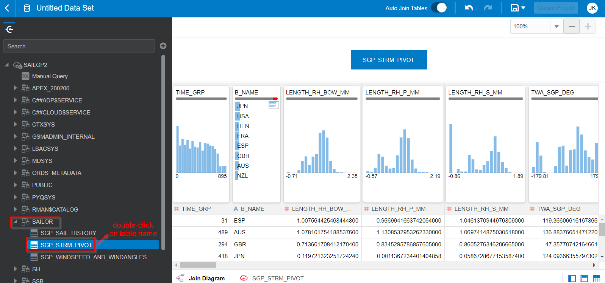

   Each record in this data set represents one second of the race for one particular team.
   At each second of the race, we can see the values of many of the sensors of the boat of each team.

   You see how Oracle Analytics is profiling the columns in the data set. It creates histograms and other charts of each of the columns to quickly give you insight into what value there is in them. For example, have a look at column B_NAME. This shows you that there are 8 countries that are competing (column B_NAME). And have a look at LENGTH_RH_BOW_MM, which shows you how far the boat comes out of the water, which has values appear to hover between 0 and 1.15m above the water.

   These graphs are a great way to quickly get a first idea about your data.

4. Configure the details of the dataset

   Now at the bottom of the screen, click on SGP_STRM_PIVOT to configure the details of the dataset.

   

5. Modify TIME_GRP column

   This attribute contains the time in the race, in seconds. For example, -30 indicates 30 seconds before the start of the race. Value 0 indicates the start of the race, et cetera.

   Right now it is classified as a METRIC (visible because of the # symbol). However, we will not use this attribute to calculate, therefore we will convert this into an ATTRIBUTE.

   Click the header of the TIME_GRP column, then click the value next to "Treat As" and change it to "Attribute".

   

   The symbol next to the column header changes to "A".

6. Pivot the representation

   Pivot the presentation so it becomes easier to modify the column configuration.

   

7. Modify the aggregation type of BOAT_SPEED_KNOTS (boat speed in knots)

   Later on, we'll want to obtain the Maximum Boat Speed for each team. Because of this, we want to set the default aggregation of the BOAT_SPEED_KNOTS field to "Maximum".

   Find the BOAT_SPEED_KNOTS column and click it, then change the aggregation to "Maximum".

   

8. Modify the aggregation type of TWS_MHU_TM_KM_H_1 (wind speed)

   Similarly, later on we'll want to obtain the Average Wind Speed.
   Because of this, we want to set the default aggregation of the TWS_MHU_TM_KM_H_1 (wind speed) to "Average".

   Find the TWS_MHU_TM_KM_H_1 column and click it, then change the aggregation to "Average".

   

9. Save the data set

   Finally, click the "Save" icon and give the data set a logical name, e.g. "Race Data".

   

## **STEP 3:** Basic statistics

1. Still in the data set editor, on the top right, click "Create Project".

   

   Now you have prepared your data, you are ready to start creating some visualizations and finally get some insights!

2. See who were the winners of the race

   Find out who took the least time to go from start to finish by creating a chart on B_NAME (team name) and TIME_SAILED (the number of seconds they were sailing).

   Drag B_NAME to the canvas.

   

   Search for the TIME_SAILED column and drag it to the canvas as well.

   

   The result should look like this. You have a simple table with the time that each team took to complete the race.

   Let's make this a bit easier to interpret: Change the representation to horizontal bar chart.

   

   We want to see the fastest team first, so let's change the sorting. Click the "Sorting" icon (top right).

   

   Configure the sorting to be by TIME_SAILED from low to high.

   

   We can see that Great Britain was the winner, followed by Australia.

   Actually, Japan and the USA did not finish the race because they collided. Let's remove them from the outcome by adding a filter. Drag B_NAME to the filter area.

   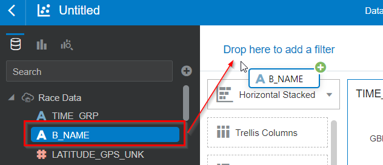

   Then configure the filter to include all countries apart from JPN and USA. You see how the chart now contains only the 6 remaining teams.

   

   You see that the boats that finished latest were France and Denmark. In what follows now, we will compare France and Denmark to the Great Britain, to see how they are different. Hopefully with this we will find some indicators on what France and Denmark can improve!

3. Compare maximum boat speeds

   Which teams are able to sail the boat the fastest? This is only a very rough indicator, because it's not just about sailing the fastest, but also the shortest/best route. Remember, in sailing, boats can take different courses to reach the waymarks. Therefore, the shortest isn't always the fastest, and the highest speed doesn't necessarily means the fastest to reach the finish line.

   Let's first convert the speed on the boat from knots into kilometers/hour or miles/hour (whichever you prefer). Scroll down to the bottom of the columns in the data set, here you'll see "My Calculations". Right-click it and select "Add Calculation".

   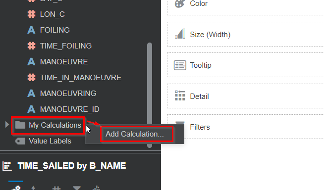

   Call the field Boat Speed KMPH (or "MIPH" if you prefer). Then drag the BOAT_SPEED_KNOTS field to the formula section.

   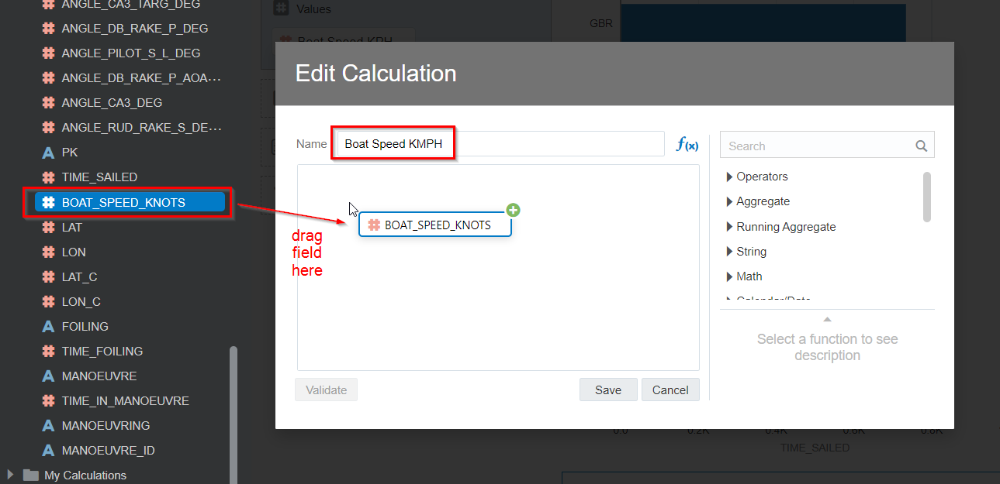

   Next, add the correct multiplier. The factor for knots to KPH is 1.852. Feel free to look up the factor to convert knots to MPH instead.

   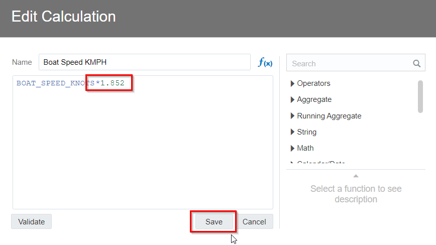

   Now visualize the newly calculated field by right clicking on "Boat Speed KPH" and choosing "Create Best Visualization".

   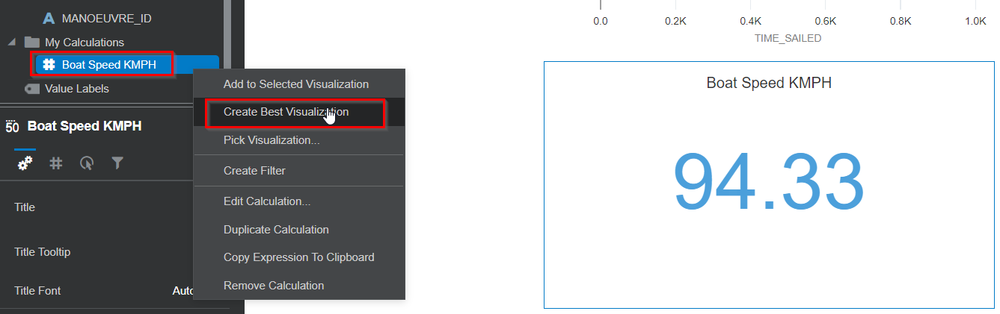

   This shows the maximum speed across all boats in this race. In fact, this was a new record for all SailGP races so far! Have a look at this fragment:

   Now, show what the maximum speeds are for all countries, by dragging B_NAME onto the same chart.

   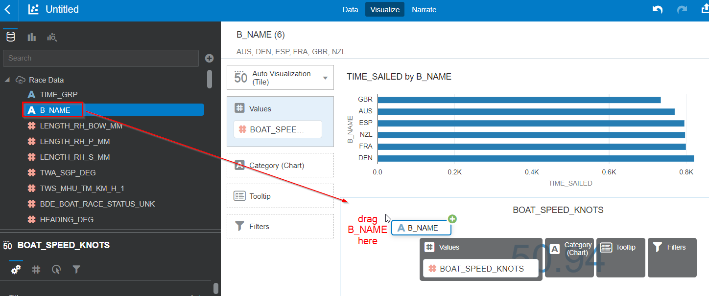

   Change the chart-type to "Horizontal Stacked".

   

   Sort the chart by by boat speed.

   
   

   In this case, the teams that have the higher maximum speed also are the teams that are finishing highest. However we have to be careful drawing any conclusions from this. Remember, in sailing the highest speed doesn't necessarily mean the best course taken.

   

4. Investigate how much the teams are foiling

   Foiling is the phenomenon where boats go fast enough to rise out of the water. Because they rise of the water, they have less water resistance, resulting in even higher speeds. Because of this, teams will always try to foil as much as possible. Let's see how well the teams are able to foil.

   First create a calculation to calculate the percentage of time that teams are foiling. We can use the TIME_SAILED (total time to complete race) and TIME_FOILING for this. Add a calculation (right click on "My Calculations") and create the following formula. Remember that you can drag the fields in from the left to add them to the formula.

   

   Now create a chart to display the foiling percentage for all the teams. First, create a new chart with overall foiling percentage by right clicking on the new Foiling Percentage field and choosing "Create Best Visualization"

   

   Now add the B_NAME column in the visualization to show the foiling percentage per team.

   

   Change the chart type to Horizontal Bar Stacked.

   

   And change the sorting to be on Foiling Percentage high to low.

   

   We can see that, although Denmark does a good job foiling, they are still the last team to arrive.

   Save the project.

   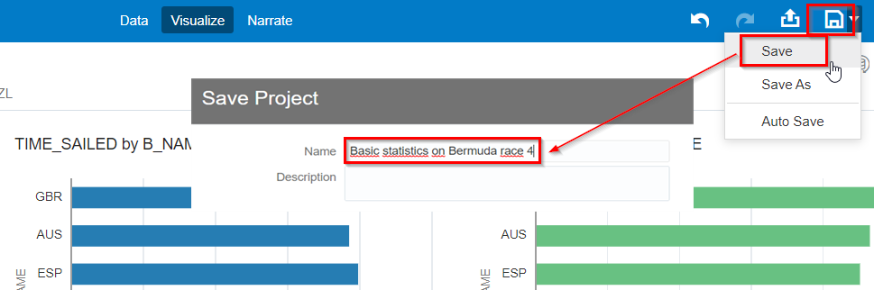

   Go back to the home page.

   

## **STEP 4**: Investigate start performance - part 1

The start of the race is very important. Often, who will win the race is decided in these crucial first moments. Teams want to position themselves as well as possible during the count down to the start signal. There are various criteria to deciding a good start, of which some are: a) being as close to the starting line as possible when the race starts and b) having the highest possible speed when the race starts.

1. Investigate proximity to the starting line at start signal

   We'd like to use a geographical visualization to see how close they are to the starting line during the starting signal. Luckily, our data contains the geographical coordinate of each boat at each moment in the race. However, we first have to instruct Oracle Analytics Cloud to interpret our coordinates as such.

   From the home page of Oracle Analytics Cloud, choose "Data", then click the ribbon and select "Open".

   

   Find the "LAT" column (Be careful not to take the the "LAT_C" or "LATITUDE" columns by accident), and chance "Treat As" to Attribute.

   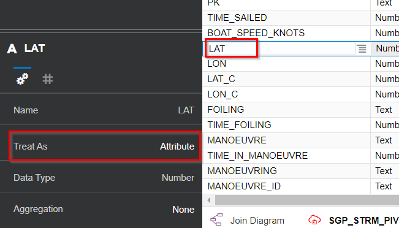

   Next, click on the ribbon next to the "LAT" field and choose "Location Details".

   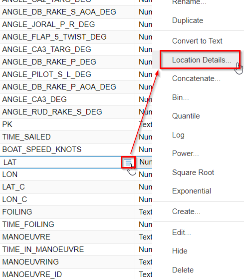

   Make sure that the Location Details configuration is as follows.

   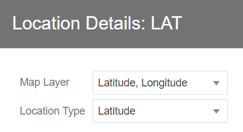

   Next, do the same thing for the "LON" column. Set the "Treat As" to Attribute.

   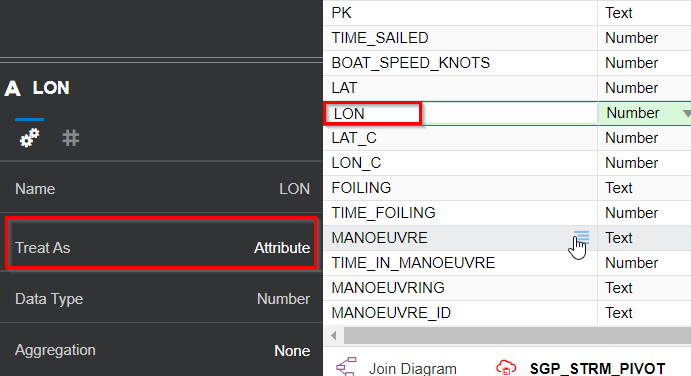

   Change the Location Details to the following.

   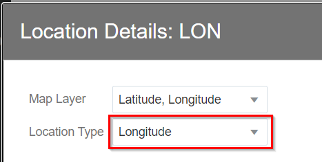

   Now we're ready to create a project for this data. Save the changes to the data set if you're being asked to.

   

   Now we want to visualize our coordinates (comprised of LAT-LON). Select the LAT and LON column (use Control to select multiple columns). Then drag them to the canvas.

   

   You should see the following:

   

   We want to be able to distinguish the path of each team separately. Let's color-code each team. Drag the B_NAME column to the "Color" field.

   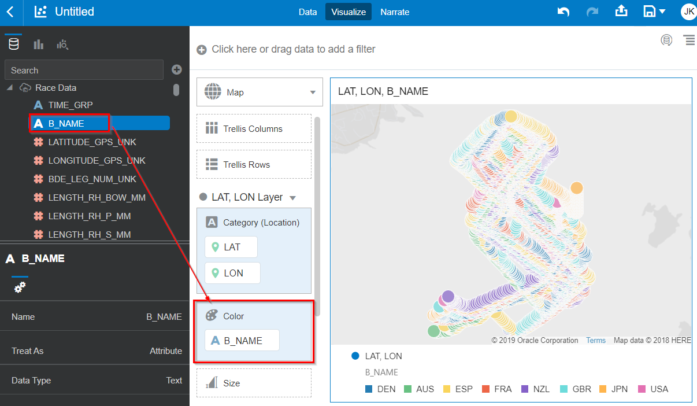

   This shows each team as a separate color. However, it's still a lot of data to digest. How do we zoom in on only the data that's relevant for that start? Let's filter the data to show only the first seconds of the race.

   Drag TIME_GRP to the Filter area.

   

   Set the filter type to RANGE.

   

   Choose only the 10 seconds before and after the start.

   

   This still isn’t great, because we cannot see the starting line. We have no context of the track (starting line, marks, et cetera).

   So let's bring in the geographical information of the track. First Save, the project.

   

   Then, go back to the Home Page.

   

## **STEP 5**: Add geographical data of the track

1. **Download** a file that contains all the geographical elements (such as starting line, waypoints and finish line) from [File with Bermuda geo elements](data/bermuda.geojson) to your local machine. Depending on your browser, you may have to use Right Click. Make sure that the file is saved with extension `.geojson`.

2. From the ribbon on the homepage, go to the Console.

   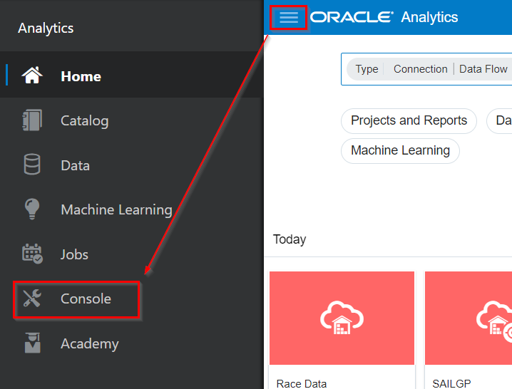

3. Select Maps.

   

4. Choose "Add Custom Layer"

   

5. Choose the file that you've just downloaded and check the "Trackelement" field. This field in the file identifies each of the geographical elements with a number. This number corresponds to the leg to which the element belongs. For example, trackelement=0 corresponds to the coordinates of the starting line, trackelement=1 corresponds to the coordinates of the first waypoint after the start and trackelement=7 corresponds to the coordinates of the finish line.

   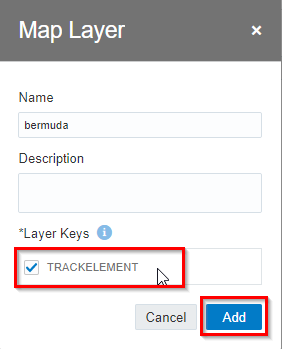

6. Next, link our dataset to the geographical data of the track. We will do this by linking the leg number to the trackelement number that we just uploaded.

7. From the home page of Oracle Analytics Cloud, choose "Data", then click the ribbon and select "Open".

   

8. Click the BDE_LEG_NUM_UNK column. This contains the current leg that each boat is sailing at a particular moment in time. Set "Treat As" to Attribute.

   

9. Next, go to the Location Details of this column.

   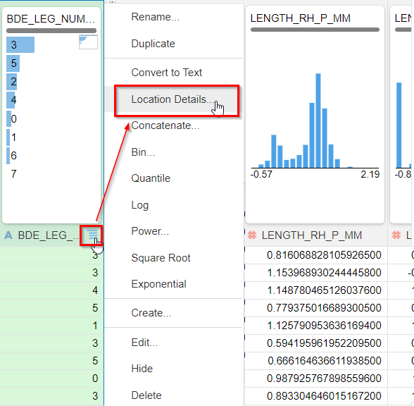

10. Select the "Bermuda" map to connect to this column. You will notice that the values in our data set ("Your Data") line up perfectly with the values in the map information that we uploaded earlier ("Match").

   

11. Go back to the Home Page and save the data set if you're being asked to.

   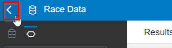

## **STEP 5**: Investigate start performance - part 2

   Now we're ready to include the geographical elements such as starting line, waypoints and finish line.

1. From the Home Page, select "Project and Reports", then click the project that we created earlier (containing the analysis of the start).

   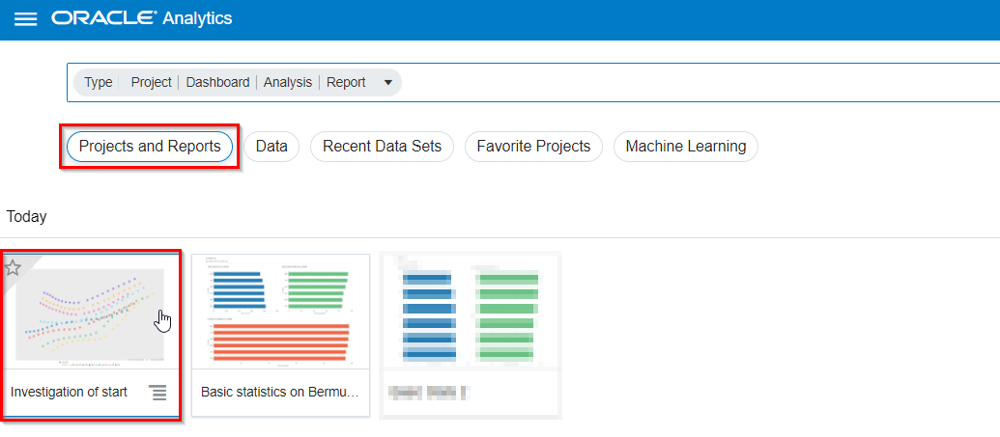

2. Click the ribbon icon next to the map configuration and choose "Add Layer".

   

3. Drag the BDE_LEG_NUM_UNK column to the Category (Location) field of the new layer.

   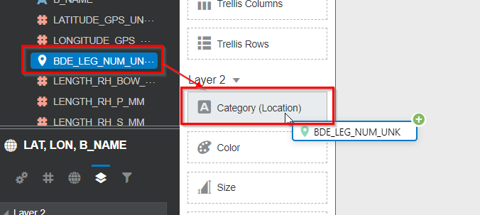

4. Select the "bermuda" layer.

   

5. You should now see the starting line as follows:

   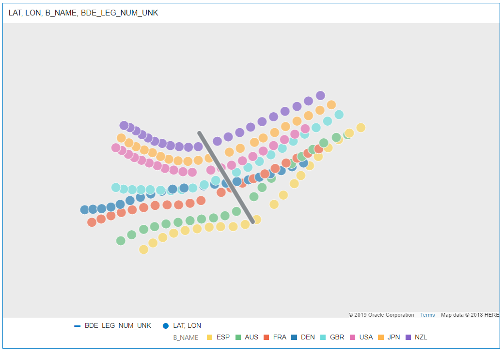

6. Now, we can finally check how far the teams are from the starting line at the start of the race.

7. We want to highlight the positions of the teams at the very start of the race. Right click on the TIME_GRP column and select "Create Best Visualization".

   

8. In the resulting table, click on the "0" to highlight the positions at TIME_GRP = 0.

   

   We can see that Spain has crossed the starting line early (they received a penalty for this). Great Britain and Australia were very close to the starting line. Denmark and France could potentially improve their timing.

9. Save the project and go back to the Home Page.

<!--10. Bonus: Evaluate the speed of the teams at the very start of the race. Which teams have the highest speed? Which teams could try to improve their speed at the start in the next race?-->

## **STEP 6**: Investigating maneuvers

   When a boat changing the side that's facing the wind, we call this a Tack or a Gybe. Although these maneuvers are necessary to reach the their waypoints, in general teams try to minimize the number of maneuvers. The reason: Maneuvers will slow down the boat for a little while. We're oversimplifying here, because often maneuvers are also done for tactical/strategical reasons.

   Let's see how well our focus teams, Denmark and France, compare to the winner, Great Britain, as it comes to maneuvers.

1. From the home page of Oracle Analytics Cloud, choose "Data", then click the ribbon and select "Open".

   

2. Find the TIME_IN_MANEUVER column and set "Treat As" to "Attribute". We'll use this field to zoom in on maneuvers only later on.

   

3. Go back to the Home Page. Save the Data Set if you're being asked to.

   

4. Open the Project that we created earlier by clicking on "Projects" and then click on the name of the project.

   

5. Compare number of maneuvers

   Delete any filter that's active. Next, add two new filters. Create a filter on B_NAME (team) to include France and Great Britain and BDE_LEG_NUM_UNK (Leg) to be 3. Then change the zoom on the map so that you can see the full leg.

   

   Count the number of places where each team changes direction. Notice how the French team makes one more manoeuver compared to Great Britain?

<!--   (OPTIONAL: ADD EXERCISE TO SEE HOW MUCH TIME THEY LOSE HERE). We can use Data Flow to extract leg time for each team-->

6. Compare quality of maneuvers

   The quality of the maneuvers is also very important. Ideally, during a maneuvers the team loses as little speed as possible. This requires very good technique and coordination between the team members.

   Let's see how France's maneuvers compare to those of the winner of the race, GBR.

   Change the filter so we only look at leg 4, and add a filter to only show the parts where teams are making a maneuvers.

   

   You now see sections of 30 seconds in which the boats change their sailing course.

   Create a new Line Chart by clicking on the Graph icon (second icon from the top left), then drag the Line icon to just left of the existing map visualization.
   

   In this chart we want to see how well the boats are able to keep out of the water during a maneuver. The boats try to not hit the water during a maneuver, to prevent losing speed. The column LENGTH_RH_BOW_MM indicates the "flying height", the distance that the boat is out of the water. The TWA_SGP_DEG column indicates the wind direction, so we can see exactly when the boat is at the middle of its maneuver.

   

   Currently we can hardly see the flying height because its values (between 0 and 1,4m) are much smaller than the wind angle (between 0 and 360). Let's add a secondary Y axis to solve that. You can find these settings on the bottom left of the screen.

   

   Maximize the chart to see it better:

   

   The way that the flight height has been configured, at a value of 0,4 the boat hits the water. Let's include a reference line to indicate this. Choose the option "Add reference line" as follows:

   

   Configure the reference line as follows (bottom left of the screen):

   

   Now, scroll through the resulting chart and compare how well each team manages to stay out of the water during manoevers. Notice how the French team comes in contact with the water more often. Feel free to investigate this for other legs of the race as well.

   

## **STEP 6**: Conclusions

Congratulations on completing this lab! You have made the first steps towards a full post-race analysis.
You've had a glimpse of the daily challenges of a SailGP Data Athlete.
You've also learned how to use Oracle Analytics Cloud to prepare and visualize your data yourself.

Now you are ready to go to the next Lab!

## **Acknowledgements**

- **Author** - Jeroen Kloosterman, Technology Product Strategy Director
- **Author** - Victor Martin, Technology Product Strategy Manager
- **Contributors** - XXX
