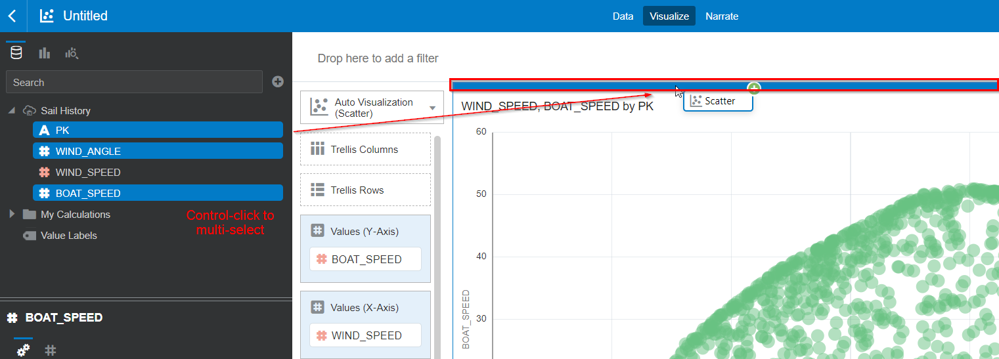
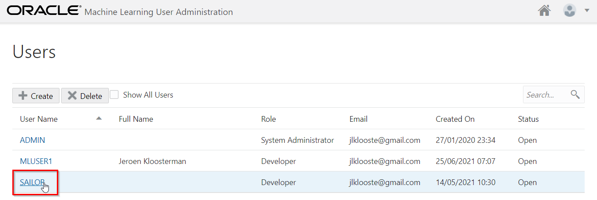
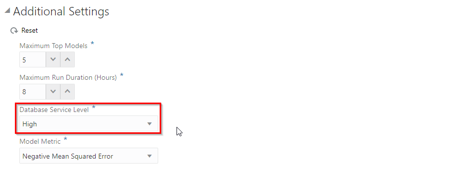
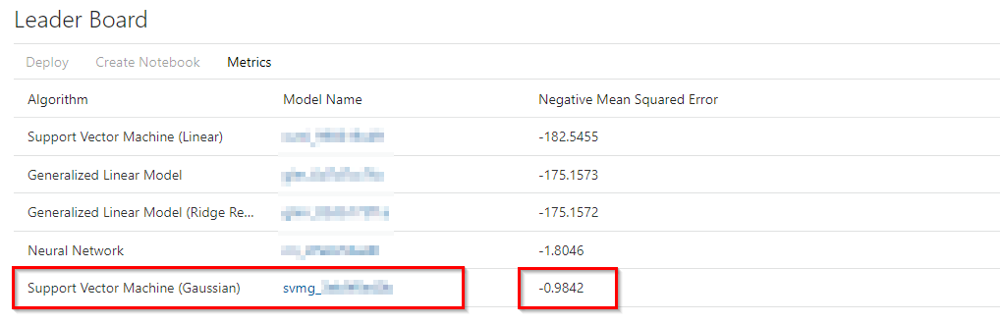
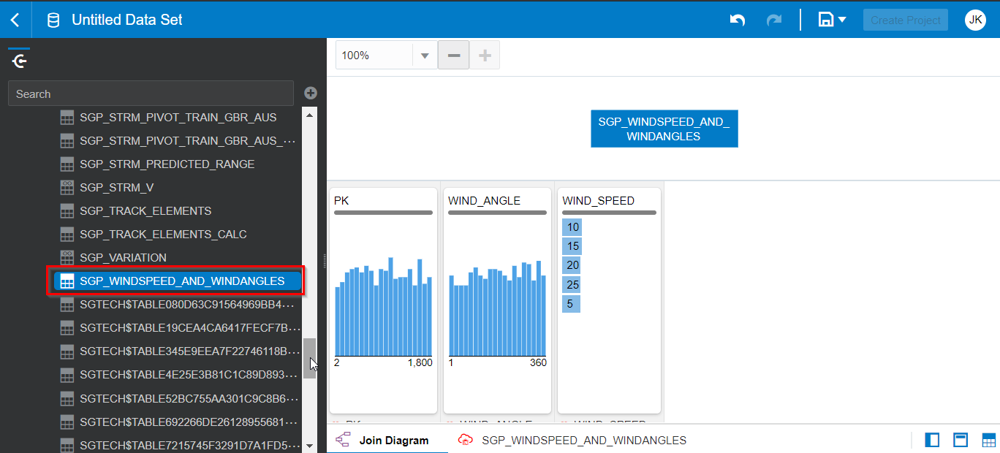
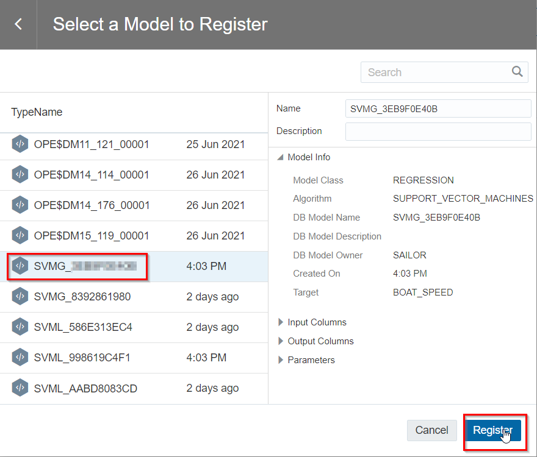
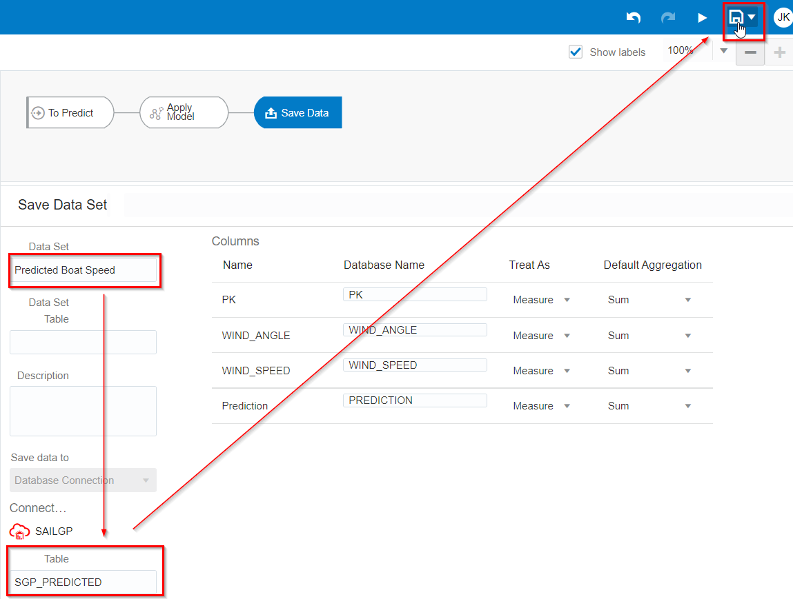

# Machine Learning


## Introduction

XXX

[](youtube:Sf5MkI9pTn0)

Estimated Lab Time: XX minutes

### Objectives

In this lab, you will:

- XXX.
- XXX.
- XXX.

### Prerequisites

- Oracle Free Trial Account
- XXX


## **STEP 1:** XXX

1. Xxx xxx **xxx** (with access from the Internet) and a **xxx** xxx.

   OAC

   

   

   

   

   

   

   

   

   

   

   

   OML

   

   

   

   

   

   

   

   

   

   

   

   

   OAC

   

   

   

   

   

   

   

   

   

   

   

   

   

   


2. Go to **Menu** > **XXX** > **XXX**.

   

   > Note: XXX.

3. Click **XXX**.

   

4. Select **XXX** and click **XXX**.

   

5. Change the **XXX** and leave everything else as **default**.

      - XXX Name: `xxx`

6. Click **Next**.

   

7. **Download** the dataset <a href="https://objectstorage.eu-frankfurt-1.oraclecloud.com/p/27PK5yRJp6ikvVdli-21D0vTwNywA0Q1aUPD2RQ7G8rtbPQwO2onh7TaZjfjawPj/n/odca/b/workshops-livelabs-do-not-delete/o/mds-di-ds-reef_life_survey_fish.csv" target="\_blank">File To Download</a>.

8. On **XXX**, create `xxxx` xxxx.

      ```
      <copy>bash command</copy>
      ```

## **STEP 2:** XXX

1. Xxx xxx **xxx** (with access from the Internet) and a **xxx** xxx.

   xxx.

2. Go to **Menu** > **XXX** > **XXX**.

   

   > Note: XXX.

3. Click **XXX**.

   

4. Select **XXX** and click **XXX**.

   

5. Change the **XXX** and leave everything else as **default**.

      - XXX Name: `xxx`

6. Click **Next**.

   

7. **Download** the dataset <a href="https://objectstorage.eu-frankfurt-1.oraclecloud.com/p/27PK5yRJp6ikvVdli-21D0vTwNywA0Q1aUPD2RQ7G8rtbPQwO2onh7TaZjfjawPj/n/odca/b/workshops-livelabs-do-not-delete/o/mds-di-ds-reef_life_survey_fish.csv" target="\_blank">File To Download</a>.

8. On **XXX**, create `xxxx` xxxx.

      ```
      <copy>bash command</copy>
      ```

## **STEP 3:** XXX


1. Xxx xxx **xxx** (with access from the Internet) and a **xxx** xxx.

   xxx.

2. Go to **Menu** > **XXX** > **XXX**.

   

   > Note: XXX.

3. Click **XXX**.

   

4. Select **XXX** and click **XXX**.

   

5. Change the **XXX** and leave everything else as **default**.

      - XXX Name: `xxx`

6. Click **Next**.

   

7. **Download** the dataset <a href="https://objectstorage.eu-frankfurt-1.oraclecloud.com/p/27PK5yRJp6ikvVdli-21D0vTwNywA0Q1aUPD2RQ7G8rtbPQwO2onh7TaZjfjawPj/n/odca/b/workshops-livelabs-do-not-delete/o/mds-di-ds-reef_life_survey_fish.csv" target="\_blank">File To Download</a>.

8. On **XXX**, create `xxxx` xxxx.

      ```
      <copy>bash command</copy>
      ```

Congratulations! You are ready to go to the next Lab!

## **Acknowledgements**

- **Author** - Jeroen Kloosterman, Technology Product Strategy Director
- **Author** - Victor Martin, Technology Product Strategy Manager
- **Contributors** - XXX
