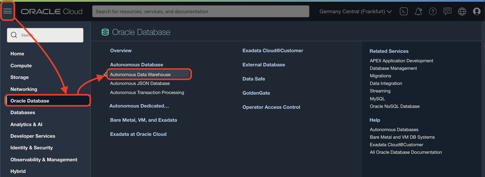

# Prepare the schema

## Introduction
In this lab you will load the SailGP data into the Autonomous Data Warehouse. You will first create a new user/schema that will hold this data. After this lab we will be ready to start analyzing the data.

Estimated Lab Time: 5 minutes

### Objectives
- Learn how to load data into the data warehouse, so you can analyze it later.

### Prerequisites
To complete this lab, you need to have the following:
- A provisioned Autonomous Data Warehouse
- You're logged into your Oracle Cloud Account

## **STEP 1**: Create a new database user/schema in Autonomous Data Warehouse to hold the data

1. Go to **Menu** > **Oracle Database** > **Autonomous Data Warehouse**.

   

2. Click on the SAILGP database that you created earlier.

   

3. Open Database Actions

   

   Login with user ADMIN, password Oracle12345! (you specified this upon creation of the Autonomous Data Warehouse earlier).

4. We're going to first create a new database user/schema that will hold the SailGP data. Open "Database Users".

   

5. Choose "Create User"

   

6. Fill in the following details:
      - User Name:  `SAILOR`
      - New Password: `Oracle12345!`
      - Confirm Password: `Oracle12345!`
      - Quota on tablespace DATA: `UNLIMITED`
      - Check "Web Access"
      - Check "OML"

   Then Create the User.

   

7. Next, give the user the access necessary to upload files through the Web UI.

   

   Confirm by clicking "Rest Enable User".

## **STEP 2**: Upload SailGP data to Autonomous Data Warehouse

1. **Download** the three files that contain the data that we'll use in our analysis: [File 1](data/sgp_strm_pivot.csv), [File 2](data/sgp_sail_history.csv) and [File 3](data/sgp_windspeed_and_windangles.csv). Save the files on your local machine. Depending on your browser, you may have to use Right Click. Make sure that the files are saved with extension `.csv`.

2. Next, again go to the Database Actions, but this time use the new **SAILOR** user.

   You should still have a browser tab open with the main page of the Autonomous Datawarehouse service. If not, navigate to this page first. Then, open Database Actions.

   

   Login with user **SAILOR**, password Oracle12345! (you specified this earlier when you created the user).

3. Click to the Data Load option.

   

4. Choose to Load Data from Local Files.

    

5. Select the 3 files that you downloaded earlier.

    

6. Start the load process

    

7. Load completed

    

Congratulations! You've successfully loaded the data into Autonomous Data Warehouse.

<!--
4. Open the SQL option.

   

6. Open the create_user_and_tables.sql file with a text editor and copy-and-paste all of its contents from the file into the worksheet area.

   

6. Click the run-script button (**not** the Run button). Then verify the output in the "Script Output" tab. The last lines in the output should indicate that the tables have been created.

   

7.

7. Your Autonomous Data Warehouse is ready to use.
-->

You can now proceed to the next lab.

## **Acknowledgements**

- **Author** - Jeroen Kloosterman, Technology Product Strategy Director
- **Author** - Victor Martin, Technology Product Strategy Manager
- **Contributors** - XXX
